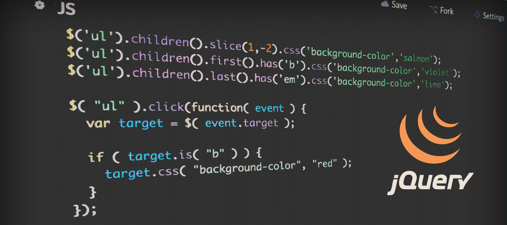

<p align="center"></p>

<h1 align="center">
    jQuery - JavaScript framework
</h1>

<h3 align="center">  
    <a target="_blank" href="https://jquery.com/">jQuery</a>
	<span> · </span>
	<a target="_blank" href="https://notepad-plus-plus.org/">Notepad++</a>
	<span> · </span>
	<a target="_blank" href="http://brackets.io/">Brackets</a>
	<span> · </span>
	<a target="_blank" href="https://www.sublimetext.com/">Sublime text</a>
	<span> · </span>
	<a target="_blank" href="https://www.adobe.com/products/dreamweaver.html">Dreamweaver</a>
</h3>

## Contents

- [Notepad++](#notepad++---editor)
- [Brackets](#brackets---editor)
- [Sublime text](#sublime-text---editor)
- [Dreamweaver](#dreamweaver---editor)
- [jQuery](#jquery)
- [installing jQuery](#installing-jquery)
- [To test it out](#to-test-it-out)
- [hide() and show()](#hide()-and-show())
- [Events](#events)
- [Fade](#fade)
- [Slide](#slide)
- [Animate](#animate)
- [Stop animation](#stop-animation)
- [Callback](#callback)
- [Chaining](#chaining)
- [Get](#get)
- [Set](#set)
- [Add](#add)
- [Remove](#remove)
- [Get and Set CSS classes](#get-and-set-css-classes)
- [CSS](#css)
- [Dimensions](#dimensions)
- [Traversing](#traversing)
- [AJAX](#ajax)
- [Miscellaneous](#miscellaneous)
- [Properties](#properties)


## Notepad++ - Editor
Notepad++ is a free (as in “free speech” and also as in “free beer”) source code editor and Notepad replacement that supports several languages. Running in the MS Windows environment. \
**Homepage:** \
https://notepad-plus-plus.org/


## Brackets - Editor
Brackets is a free open source powerful lightweight text(code) editor. It blends visual tools into the editor so you get the right amount of help when you want it without getting in the way of your creative process. For both Mac and Windows. \
**Homepage:**\
http://brackets.io/ \
**Versions:** \
https://github.com/adobe/brackets/releases


## Sublime text - Editor
**Homepage:** \
https://www.sublimetext.com/


## Dreamweaver - Editor
Create, code, and manage dynamic websites easily with a smart, simplified coding engine. Access code hints to quickly learn and edit HTML, CSS, and other web standards. And use visual aids to reduce errors and speed up site development. \
**Homepage:** \
https://www.adobe.com/products/dreamweaver.html

**Dreamweaver is not Freeware!**


## jQuery
jQuery - JavaScript framework \
**Homepage:** \
https://jquery.com/

https://www.w3schools.com/jquery/

## Installing jQuery
1. Download jQuery('jquery-3.5.1.min.js' file) from: https://jquery.com/download/
2. Save downloaded file int your projects JavaScript('js' or 'script') folder.
3. Add script tag to your HTML 'head' section:
```
<script src="js/jquery-3.5.1.min.js"></script>
```

## To test it out
Add following code to your HTML head:
```
    <script>
        $("document").ready(function(){
            $("body").append("<h1>I love jQuery</h1>")
        });
    </script>
```
**Output:** \
I love jQuery

## hide() and show()

**$(this).hide()** - hides the current element. \
**$("p").hide()** - hides all <p> elements. \

**$(".test").hide()** - hides all elements with class="test". \
**$("#test").hide()** - hides the element with id="test". \

Code example with onclick:
```
$(document).ready(function(){
    $("p").click(function(){
        $(this).hide();
    });
    
    $("#show").click(function(){
        $("p").show();
    });
});
```

## Events

| Mouse Events | Keyboard Events | Form Events | Document/Window Events |
|--------------|-----------------|-------------|------------------------|
| click        | keypress        |	submit     | load                   |
| dblclick     | keydown         |	change     | resize                 |
| mouseenter   | keyup           |  focus      | scroll                 |
| mouseleave   |                 |  blur       | unload                 |


**mouseenter()** - The function is executed when the mouse pointer enters the HTML element: \
Code example:
```
$("#p1").mouseenter(function(){
  alert("You entered p1!");
});
```

## Fade
jQuery has the following fade methods to fade elements in and out of visibility:

* fadeIn()
* fadeOut()
* fadeToggle()
* fadeTo()

Code example:
```
$("button").click(function(){
  $("#div1").fadeIn();
  $("#div2").fadeIn("slow");
  $("#div3").fadeIn(3000);
}); 
```

## Slide
jQuery has the following slide methods to slide elements up and down:

* slideDown()
* slideUp()
* slideToggle()

Code example:
```
$("#flip").click(function(){
  $("#panel").slideDown();
}); 
```

## Animate
Code example:
```
$("button").click(function(){
  $("div").animate({
    left: '250px',
    opacity: '0.5',
    height: '150px',
    width: '150px'
  });
});  
```

## Stop animation
Code example:
```
$("#stop").click(function(){
  $("#panel").stop();
}); 
```

## Callback
A callback function is executed after the current effect is 100% finished. \
Code example:
```
$("button").click(function(){
  $("p").hide("slow", function(){
    alert("The paragraph is now hidden");
  });
}); 
```

## Chaining
With jQuery, you can chain together actions/methods. \
Chaining allows us to run multiple jQuery methods (on the same element) within a single statement.

Code example:
```
$("#p1").css("color", "red").slideUp(2000).slideDown(2000); 
```

## Get
jQuery contains powerful methods for changing and manipulating HTML elements and attributes. \
Three simple, but useful, jQuery methods for DOM manipulation are: \
* **text()** - Sets or returns the text content of selected elements
* **html()** - Sets or returns the content of selected elements (including HTML markup)
* **val()** - Sets or returns the value of form fields

Code example for **text()** and **html()** methods:
```
$("#btn1").click(function(){
  alert("Text: " + $("#test").text());
});
$("#btn2").click(function(){
  alert("HTML: " + $("#test").html());
});
```

## Set
jQuery set methods: \
* **text()** - Sets or returns the text content of selected elements
* **html()** - Sets or returns the content of selected elements (including HTML markup)
* **val()** - Sets or returns the value of form fields

Code example:
```
$("#btn1").click(function(){
  $("#test1").text("Hello world!");
});
$("#btn2").click(function(){
  $("#test2").html("<b>Hello world!</b>");
});
$("#btn3").click(function(){
  $("#test3").val("Dolly Duck");
});
```

## Add
Methods to add new content:
* **append()** - Inserts content at the end of the selected elements
* **prepend()** - Inserts content at the beginning of the selected elements
* **after()** - Inserts content after the selected elements
* **before()** - Inserts content before the selected elements

Code example:
```
function appendText() {
  var txt1 = "<p>Text.</p>";               // Create element with HTML 
  var txt2 = $("<p></p>").text("Text.");   // Create with jQuery
  var txt3 = document.createElement("p");  // Create with DOM
  txt3.innerHTML = "Text.";
  $("body").append(txt1, txt2, txt3);      // Append the new elements
} 
```

## Remove
To remove elements and content, there are mainly two jQuery methods:
* **remove()** - Removes the selected element (and its child elements)
* **empty()** - Removes the child elements from the selected element

Code example:
```
$("#div1").remove();

$("#div1").empty(); 
```

## Get and Set CSS classes
jQuery has several methods for CSS manipulation. We will look at the following methods:
* **addClass()** - Adds one or more classes to the selected elements
* **removeClass()** - Removes one or more classes from the selected elements
* **toggleClass()** - Toggles between adding/removing classes from the selected elements
* **css()** - Sets or returns the style attribute

Code example:
```
$("button").click(function(){
  $("h1, h2, p").addClass("blue");
  $("div").addClass("important");
});
```

## CSS
* **css()** method sets or returns one or more style properties for the selected elements.

Code example to get 'p' element background color rgb value:
```
$(document).ready(function(){
  $("button").click(function(){
    alert("Background color = " + $("p").css("background-color"));
  });
});
```

## Dimensions
jQuery dimension methods:
* **width()**
* **height()**
* **innerWidth()**
* **innerHeight()**
* **outerWidth()**
* **outerHeight()**


Code example:
```
$("button").click(function(){
  var txt = "";
  txt += "Width: " + $("#div1").width() + "</br>";
  txt += "Height: " + $("#div1").height();
  $("#div1").html(txt);
}); 
```

## Travesing
jQuery traversing, which means "move through", are used to "find" (or select) HTML elements based on their relation to other elements. Start with one selection and move through that selection until you reach the elements you desire.


jQuery travesing methods:
| Method          |	Description |
|-----------------|----------------------------------------------------------------------------------------------------|
| add() |	Adds elements to the set of matched elements |
addBack() |	Adds the previous set of elements to the current set
andSelf() |	Deprecated in version 1.8. An alias for addBack()
children() |	Returns all direct children of the selected element
closest() |	Returns the first ancestor of the selected element
contents() |	Returns all direct children of the selected element (including text and comment nodes)
each() |	Executes a function for each matched element
end() |	Ends the most recent filtering operation in the current chain, and return the set of matched elements to its previous state
eq() |	Returns an element with a specific index number of the selected elements
filter() |	Reduce the set of matched elements to those that match the selector or pass the function's test
find() |	Returns descendant elements of the selected element
first() |	Returns the first element of the selected elements
has() |	Returns all elements that have one or more elements inside of them
is() |	Checks the set of matched elements against a selector/element/jQuery object, and return true if at least one of these elements matches the given arguments
last() |	Returns the last element of the selected elements
map() |	Passes each element in the matched set through a function, producing a new jQuery object containing the return values
next() |	Returns the next sibling element of the selected element
nextAll() |	Returns all next sibling elements of the selected element
nextUntil() |	Returns all next sibling elements between two given arguments
not() |	Returns elements that do not match a certain criteria
offsetParent() |	Returns the first positioned parent element
parent() |	Returns the direct parent element of the selected element
parents() |	Returns all ancestor elements of the selected element
parentsUntil() |	Returns all ancestor elements between two given arguments
prev() |	Returns the previous sibling element of the selected element
prevAll() |	Returns all previous sibling elements of the selected element
prevUntil() |	Returns all previous sibling elements between two given arguments
siblings() |	Returns all sibling elements of the selected element
slice() |	Reduces the set of matched elements to a subset specified by a range of indices

## AJAX
jQuery AJAX Methods:

| Method |	Description |
|------------------------|-------------------------------------------------------------------------|
$.ajax() |	Performs an async AJAX request
$.ajaxPrefilter() |	Handle custom Ajax options or modify existing options before each request is sent and before they are processed by $.ajax()
$.ajaxSetup() |	Sets the default values for future AJAX requests
$.ajaxTransport() |	Creates an object that handles the actual transmission of Ajax data
$.get() |	Loads data from a server using an AJAX HTTP GET request
$.getJSON() |	Loads JSON-encoded data from a server using a HTTP GET request
$.parseJSON() |	Deprecated in version 3.0, use JSON.parse() instead. Takes a well-formed JSON string and returns the resulting JavaScript value
$.getScript() |	Loads (and executes) a JavaScript from a server using an AJAX HTTP GET request
$.param() |	Creates a serialized representation of an array or object (can be used as URL query string for AJAX requests)
$.post() |	Loads data from a server using an AJAX HTTP POST request
ajaxComplete() |	Specifies a function to run when the AJAX request completes
ajaxError() |	Specifies a function to run when the AJAX request completes with an error
ajaxSend() |	Specifies a function to run before the AJAX request is sent
ajaxStart() |	Specifies a function to run when the first AJAX request begins
ajaxStop() |	Specifies a function to run when all AJAX requests have completed
ajaxSuccess() |	Specifies a function to run when an AJAX request completes successfully
load() |	Loads data from a server and puts the returned data into the selected element
serialize() |	Encodes a set of form elements as a string for submission
serializeArray() |	Encodes a set of form elements as an array of names and values

## Miscellaneous
jQuery Misc Methods:

| Method |	Description |
|-----------------|-------------------------------------------------------------------------|
data() |	Attaches data to, or gets data from, selected elements
each() |	Execute a function for each matched element
get() |	Get the DOM elements matched by the selector
index() |	Search for a given element from among the matched elements
$.noConflict() |	Release jQuery's control of the $ variable
$.param() |	Create a serialized representation of an array or object (can be used as URL query string for AJAX requests)
removeData() |	Removes a previously-stored piece of data
size() |	Removed in version 3.0. Use the length property instead
toArray() |	Retrieve all the DOM elements contained in the jQuery set, as an array

## Properties
jQuery Properties

| Property |	Description |
|--------------------|----------------------------------------------------------------------|
context |	Removed in version 3.0. Contains the original context passed to jQuery()
jquery |	Contains the jQuery version number
jQuery.fx.interval |	Change the animation firing rate in milliseconds
jQuery.fx.off |	Globally disable/enable all animations
jQuery.support |	A collection of properties representing different browser features or bugs (Intended for jQuery's internal use)
length |	Contains the number of elements in the jQuery object


