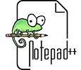
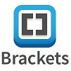

jQuery - JavaScript framework



## Notepad++ - Editor
Notepad++ is a free (as in “free speech” and also as in “free beer”) source code editor and Notepad replacement that supports several languages. Running in the MS Windows environment. \
**Homepage:** \
https://notepad-plus-plus.org/



## Brackets - Editor
Brackets is a free open source powerful lightweight text(code) editor. It blends visual tools into the editor so you get the right amount of help when you want it without getting in the way of your creative process. For both Mac and Windows. \
**Homepage:**\
http://brackets.io/ \
**Versions:** \
https://github.com/adobe/brackets/releases


## Sublime text - Editor
**Homepage:** \


## Dreamweaver - Editor
Create, code, and manage dynamic websites easily with a smart, simplified coding engine. Access code hints to quickly learn and edit HTML, CSS, and other web standards. And use visual aids to reduce errors and speed up site development. \
**Homepage:** \
https://www.adobe.com/products/dreamweaver.html

**Dreamweaver is not Freeware!**


## jQuery
jQuery - JavaScript framework \
**Homepage:** \
https://jquery.com/

https://www.w3schools.com/jquery/

## Installing jQuery
1. Download jQuery('jquery-3.5.1.min.js' file) from: https://jquery.com/download/
2. Save downloaded file int your projects JavaScript('js' or 'script') folder.
3. Add script tag to your HTML 'head' section:
```
<script src="js/jquery-3.5.1.min.js"></script>
```

## To test it out
Add following code to your HTML head:
```
    <script>
        $("document").ready(function(){
            $("body").append("<h1>I love jQuery</h1>")
        });
    </script>
```
**Output:** \
I love jQuery

## Hide element by onclick

**$(this).hide()** - hides the current element. \
**$("p").hide()** - hides all <p> elements.\
**$(".test").hide()** - hides all elements with class="test".\
**$("#test").hide()** - hides the element with id="test".\

Code example with onclick:
```
$(document).ready(function(){
  $("p").click(function(){
    $(this).hide();
  });
});
```

## Events

| Mouse Events | Keyboard Events | Form Events | Document/Window Events |
|--------------|-----------------|-------------|------------------------|
| click        |	keypress       |	submit     |	load                  |
| dblclick     |	keydown        |	change     |	resize                |
| mouseenter   |	keyup          |  focus      |  scroll                |
| mouseleave   |                 |  blur       |  unload                |


